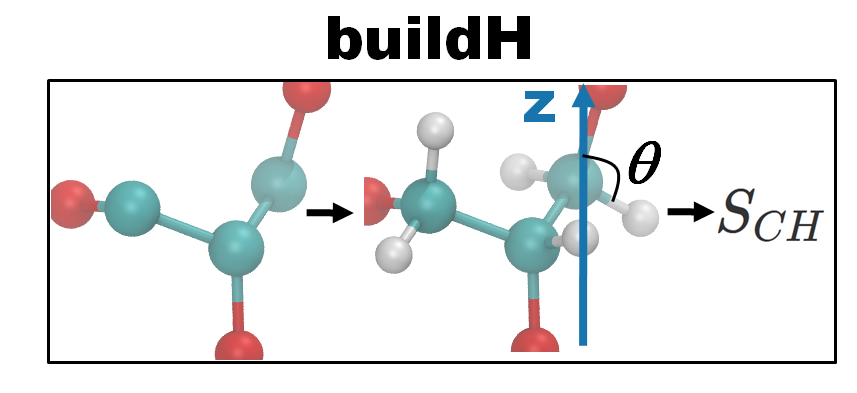

# buildH

[](https://doi.org/10.5281/zenodo.4676217)
[](https://archive.softwareheritage.org/browse/origin/?origin_url=https://github.com/patrickfuchs/buildH/)
[](https://opensource.org/licenses/BSD-3-Clause)
[](https://mybinder.org/v2/gh/patrickfuchs/buildH/master?urlpath=lab)
[](https://github.com/patrickfuchs/buildH/actions?query=workflow%3A%22GitHub+CI+code%22)
[](https://github.com/patrickfuchs/buildH/actions?query=workflow%3A%22GitHub+CI+doc%22)
[](https://buildh.readthedocs.io/en/latest/?badge=latest)
[![Powered by MDAnalysis](https://img.shields.io/badge/powered%20by-MDAnalysis-orange.svg?logoWidth=16&logo=data:image/x-icon;base64,AAABAAEAEBAAAAEAIAAoBAAAFgAAACgAAAAQAAAAIAAAAAEAIAAAAAAAAAAAAAAAAAAAAAAAAAAAAAAAAAAAAAAAAJD+XwCY/fEAkf3uAJf97wGT/a+HfHaoiIWE7n9/f+6Hh4fvgICAjwAAAAAAAAAAAAAAAAAAAAAAAAAAAAAAAACT/yYAlP//AJ///wCg//8JjvOchXly1oaGhv+Ghob/j4+P/39/f3IAAAAAAAAAAAAAAAAAAAAAAAAAAAAAAAAAAAAAAJH8aQCY/8wAkv2kfY+elJ6al/yVlZX7iIiI8H9/f7h/f38UAAAAAAAAAAAAAAAAAAAAAAAAAAB/f38egYF/noqAebF8gYaagnx3oFpUUtZpaWr/WFhY8zo6OmT///8BAAAAAAAAAAAAAAAAAAAAAAAAAAAAAAAAgICAn46Ojv+Hh4b/jouJ/4iGhfcAAADnAAAA/wAAAP8AAADIAAAAAwCj/zIAnf2VAJD/PAAAAAAAAAAAAAAAAICAgNGHh4f/gICA/4SEhP+Xl5f/AwMD/wAAAP8AAAD/AAAA/wAAAB8Aov9/ALr//wCS/Z0AAAAAAAAAAAAAAACBgYGOjo6O/4mJif+Pj4//iYmJ/wAAAOAAAAD+AAAA/wAAAP8AAABhAP7+FgCi/38Axf4fAAAAAAAAAAAAAAAAiIiID4GBgYKCgoKogoB+fYSEgZhgYGDZXl5e/m9vb/9ISEjpEBAQxw8AAFQAAAAAAAAANQAAADcAAAAAAAAAAAAAAAAAAAAAAAAAAAAAAAAAAAAAjo6Mb5iYmP+cnJz/jY2N95CQkO4pKSn/AAAA7gAAAP0AAAD7AAAAhgAAAAEAAAAAAAAAAACL/gsAkv2uAJX/QQAAAAB9fX3egoKC/4CAgP+NjY3/c3Nz+wAAAP8AAAD/AAAA/wAAAPUAAAAcAAAAAAAAAAAAnP4NAJL9rgCR/0YAAAAAfX19w4ODg/98fHz/i4uL/4qKivwAAAD/AAAA/wAAAP8AAAD1AAAAGwAAAAAAAAAAAAAAAAAAAAAAAAAAAAAAALGxsVyqqqr/mpqa/6mpqf9KSUn/AAAA5QAAAPkAAAD5AAAAhQAAAAEAAAAAAAAAAAAAAAAAAAAAAAAAAAAAADkUFBSuZ2dn/3V1df8uLi7bAAAATgBGfyQAAAA2AAAAMwAAAAAAAAAAAAAAAAAAAAAAAAAAAAAAAAAAAB0AAADoAAAA/wAAAP8AAAD/AAAAWgC3/2AAnv3eAJ/+dgAAAAAAAAAAAAAAAAAAAAAAAAAAAAAAAAAAAAAAAAA9AAAA/wAAAP8AAAD/AAAA/wAKDzEAnP3WAKn//wCS/OgAf/8MAAAAAAAAAAAAAAAAAAAAAAAAAAAAAAAAAAAAIQAAANwAAADtAAAA7QAAAMAAABUMAJn9gwCe/e0Aj/2LAP//AQAAAAAAAAAA)](https://www.mdanalysis.org)
[](https://pypi.python.org/pypi/buildh)
[](https://anaconda.org/bioconda/buildh)



> Build hydrogen atoms from united-atom molecular dynamics of lipids and calculate the order parameters

## Features

**buildH** can :
  - Reconstruct hydrogens from a **united-atom** structure file (pdb, gro) or trajectory (e.g. xtc).
  - Calculate the order parameters based on the reconstructed hydrogens.
  - Write new structure trajectory files with the reconstructed hydrogens.

**buildH** works in two modes :
  1. A slow mode when an output trajectory (in xtc format) is requested by
     the user. In this case, the whole trajectory including newly built
     hydrogens are written to this trajectory.
  2. A fast mode without any output trajectory.

In both modes, the order parameters are calculated. All calculations are accelerated with [Numba](https://numba.pydata.org/). As a CPU cost indication, running **buildH** on a trajectory of 2500 frames with 128 POPC (without trajectory output) takes ~ 7' on a single core Xeon @ 3.60GHz.

## Requirements

Python >= 3.6 and <= 3.8 is mandatory for running buildH.

**buildH** is written in Python 3 and needs the modules numpy, pandas, MDAnalysis and Numba.

## Installation

### Pip

A simple installation with pip will do the trick:

```
python3 -m pip install buildh
```

All dependencies (modules) will be installed automatically by pip.


### Conda

**buildH** is also available through the [Bioconda](https://anaconda.org/bioconda/buildh) channel:

```
conda install buildh -c bioconda -c conda-forge
```

More details on installation [here](https://buildh.readthedocs.io/en/latest/installation.html).

For installing a development version, see [here](devtools/install_dev.md).

## Running buildH

Once installed, a simple invocation of the `buildH` command will run the program (`$` represents the Unix prompt):

```
$ buildH
usage: buildH [-h] -c COORD [-t TRAJ] -l LIPID [-lt LIPID_TOPOLOGY [LIPID_TOPOLOGY ...]] -d DEFOP
              [-opx OPDBXTC] [-o OUT] [-b BEGIN] [-e END] [-pi PICKLE]
buildH: error: the following arguments are required: -c/--coord, -l/--lipid, -d/--defop
```

The minimal command for running **buildH** can resemble this:

```
$ buildH -c start_128popc.pdb -t popc0-25ns_dt1000.xtc -l Berger_POPC -d Berger_POPC.def
```

The different arguments mean the following: `-c start_128popc.pdb` is a pdb file with 128 POPC molecules, `-t popc0-25ns_dt1000.xtc` is a trajectory with 25 frames, `-l Berger_POPC` indicates the united-atom force field and the type of lipid to be analyzed, `-d Berger_POPC.def` indicates what C-H are considered for H building and order parameter calculation (the structure and trajectory files can be found [here](https://github.com/patrickfuchs/buildH/tree/master/docs/Berger_POPC_test_case)). The def file can be found [here](https://github.com/patrickfuchs/buildH/blob/master/def_files/Berger_POPC.def). The final order parameters averaged over the trajectory will be written to the default output name `OP_buildH.out`

Other detailed examples and Jupyter Notebooks can be found in the documentation at [Read the Docs](https://buildh.readthedocs.io/en/latest/index.html).

**Important**: sometimes, when performing MD, some molecules are split over periodic boundary conditions (PBC). **buildH** takes as input whole structures (pdb, gro, xtc, etc.). If broken molecules are supplied, it will most likely generate nonsense results. So it is up to the user to take care of making molecules whole before running **buildH** (e.g. by using a tool like [trjconv](https://manual.gromacs.org/current/onlinehelp/gmx-trjconv.html) in GROMACS with flag `-pbc mol`).

Invoking **buildH** with the `-h` flag will display some help to the screen and tell which lipids are supported.

```
$ buildH -h
usage: buildH [-h] [-v] -c COORD [-t TRAJ] -l LIPID [-lt LIPID_TOPOLOGY [LIPID_TOPOLOGY ...]] -d
              DEFOP [-opx OPDBXTC] [-o OUT] [-b BEGIN] [-e END]
[...]
The list of supported lipids (-l option) are: Berger_CHOL, Berger_DOPC, Berger_DPPC, Berger_POP, Berger_POPC, Berger_PLA, Berger_POPE, Berger_POPS, CHARMM36UA_DPPC, CHARMM36UA_DPUC, CHARMM36_POPC, GROMOS53A6L_DPPC, GROMOSCKP_POPC, GROMOSCKP_POPS. More documentation can be found at https://buildh.readthedocs.io.
```

## Documentation

The full documentation is available at [Read the Docs](https://buildh.readthedocs.io/en/latest/index.html).

## Contributors

- Hubert Santuz
- Amélie Bâcle
- Pierre Poulain
- Patrick Fuchs

## License

**buildH** is licensed under the [BSD License](LICENSE.txt).


## Contributing

If you want to report a bug, request a feature, or propose an improvement use the [GitHub issue system](https://github.com/patrickfuchs/buildH/issues/).

Please, see also the [CONTRIBUTING](CONTRIBUTING.md) file.

Note that this project is released with a [Contributor Code of
Conduct](http://contributor-covenant.org/). By participating in this project you
agree to abide by its terms. See the [CODE_OF_CONDUCT](CODE_OF_CONDUCT.md) file.
