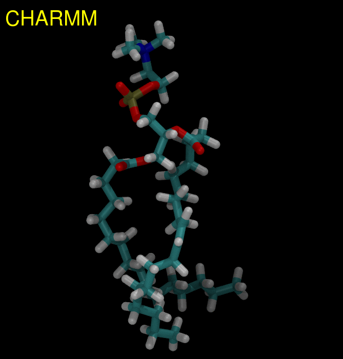

# Validation of buildH 

**buildH** reconstructs hydrogens from a united-atom trajectory and calculates the order parameter on each reconstructed C-H bond. To validate **buildH**, we took an all-atom POPC trajectory generated with the CHARMM36 force field. First, we removed the hydrogens and reconstructed them with **buildH**. Then we compared the H reconstruction and the order parameter values calculated with **buildH** to the real ones from the all-atom trajectory. The output of **buildH** was also compared to two  scripts made by Josef Melcr and Angel Pineiro.

Here is a [report](report_buildH.pdf) made in August 2019 describing this validation.

All the files used for making this validation have been deposited on [Zenodo](https://zenodo.org/record/4715962) with the following DOI: 10.5281/zenodo.4715962.

Below is shown an animated gif highlighting the tiny difference between the hydrogens in a CHARMM36 POPC vs those reconstructed by **buildH**.

Note that this validation was made in August 2019. You can retrieve the corresponding old version of **buildH** [here](https://github.com/patrickfuchs/buildH/tree/7cf8a331b1758abffd03ebb9737704dee3f12a88).
