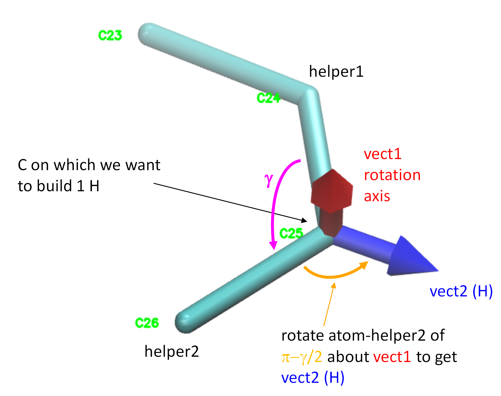

# Algorithms for building hydrogens

**buildH** builds hydrogens using general geometric rules which are explained in this document. All the Python functions implementing these reconstructions are written in [`hydrogens.py`](https://github.com/patrickfuchs/buildH/blob/master/buildh/hydrogens.py). These functions are largely inspired from [a code of Jon Kapla](https://github.com/kaplajon/trajman/blob/master/module_trajop.f90#L242) originally written in fortran. All mathematical functions (vector operations, rotations, etc.) are written in [`geometry.py`](https://github.com/patrickfuchs/buildH/blob/master/buildh/hydrogens.py) and accelarated using [Numba](https://numba.pydata.org/). In this page, we use the following conventions:

- the word `helper` describes heavy atoms connected (or not far away) to the carbon on which we reconstruct Hs, their position is used in the process of H reconstruction;
- all represented vectors are unit vectors;
- $\theta$ is the [tetrahedral bond angle](https://en.wikipedia.org/wiki/Tetrahedron) which equals arccos(-1/3) rad ~ 1.9106 rad ~ 109.47°; 
- all the angles will be described in rad;
- $l_{CH}$ is the [carbon-hydrogen bond length](https://en.wikipedia.org/wiki/Carbon%E2%80%93hydrogen_bond) which equals ~ 1.09 Å.

All images in this page were generated using [VMD](http://www.ks.uiuc.edu/Research/vmd/).

## Building CH3

Building a methyl on a primary carbon (`C1`) requires two helpers: i) helper1 (`N4`) is connected to that carbon, ii) helper2 (`C5`) is connected to helper1. As described [here](json_format.md#ch3), helper1 has to be a heavy atom connected to the primary carbon, helper2 is a heavy atoms 2 atoms away from the primary carbon. In some cases, there may be multiple choices for helper2 (such as in the CH3s of choline in PC lipids). Any choice is fine, as long as the rule explained here is followed (helper1 connected to the carbon, helper2 is 2 atoms away).

We start with the first hydrogen reconstruction as explained in the figure below.

`vect1` (red) is first computed as the vector product between vectors "carbon -> helper2" and "carbon -> helper1", it will be our rotation axis in the next step. `vect2` (blue) is then computed by rotating vector "carbon -> helper1" about `vect1` by $\theta$ rad. The first H will be obtained by translating a point located at the "carbon" along `vect2` of $l_{CH}$ Å. Note that the newly built H is in a *trans* configuration with respect to helper2.

We then go on with the reconstruction of the two other Hs as explained in the figure below.

`vect3` (green) is obtained by rotating `vect2` of $-\frac{2\pi}{3}$ rad about vector "carbon -> helper1". 
`vect4` (magenta) is obtained by rotating `vect2` of $+\frac{2\pi}{3}$ rad about vector "carbon -> helper1". 

The second and third H will be obtained by translating of $l_{CH}$ Å a point located at the "carbon" along `vect3` and `vect4` respectively.

## Building CH2

The building of 2 hydrogens on a secondary carbon involves a few geometrical procedures that are explained in the figure below.

We start with the 3 atoms, the central carbon on which we want to reconstruct hydrogens (`C26`), helper1 (`C25`) and helper2 (`C27`) which are heavy atoms connected to the central carbon. The two helpers will help us build the new hydrogens following standard [tetrahedral geometry](https://en.wikipedia.org/wiki/Tetrahedral_molecular_geometry). 

On the left panel, we first show how to construct 3 vectors:

- `vect1` (red) is normal to the plane of the 3 atoms. It is calculated as the cross product between vectors "central carbon -> helper2" and "central carbon -> helper1".
- `vect2` (blue) will be our **rotation axis** used later. It is calculated as vector "central carbon -> helper1" minus vector "central carbon -> helper2".
- `vect3` (green) is a vector that will be rotated in the next step. It is the cross product between `vect1` and `vect2`.

On the right panel, we go on to construct 2 other vectors:

- `vect4` (magenta) is obtained by rotating `vect3` of $\frac{\theta}{2}$ rad about `vect2`. The first H will be obtained by translating a point located at the central carbon along `vect4` of $l_{CH}$ Å.
- `vect5` (orange) is obtained by rotating `vect3` of $-\frac{\theta}{2}$ rad about `vect2`. The second H will be obtained by translating a point located at the central carbon along vect5 of $l_{CH}$ Å.

**Important**: last, we want to stress that the **order of helpers** matters as described [here](json_format.md#ch2). If the two helpers are switched, the two reconstructed Hs will be switched too, so this will have a consequence on which one is pro-R and pro-S.

## Building CH

The building of 1 hydrogen on a tertiary carbon is quite simple. This carbon can be asymetric. In a POPC lipid there is a single case of tertiary carbon on the second carbon of glycerol. In natural phospholipids, this carbon is in *R* configuration. 

The figure below  shows an example using a Berger POPC. The central carbon on which we want to reconstruct one H is the second carbon of the glycerol (`C13`). Helper1 (`C13`) is the third glycerol carbon (towards sn-3, that is, the polar head),  helper2 (`C32`) is the fist glycerol carbon (towards sn-1) and helper3  (`O14`) is the glycerol oxygen towards sn-2. Importantly, the order of helpers (what is helper1, helper2 and helper3) does not matter in this case, any combination will lead to the same H resconstruction.

We first compute the red vector `vect1` as the sum of the 3 vectors "central carbon -> helper1" + "central carbon -> helper2" + "central carbon -> helper3". We see that this `vect1` defines a [median](https://en.wikipedia.org/wiki/Median_(geometry)#Tetrahedron) of the tetrahedron. The blue vector `vect2` is merely the opposite of `vect1` and gives the direction of the C-H bond. The new H will be obtained by translating a point located at the central carbon along `vect2` of $l_{CH}$ Å.

## Building CH on a double bond

For the H to reconstruct on a carbon involved in a double bond, **buildH** uses the following strategy as explained in the figure below.

First we compute the angle $\gamma$ between atoms "helper1-central carbon-helper2". `vect1` is next calculated as the cross product between vectors "central carbon -> helper1" and "central carbon -> helper2". `vect1` will be used in the next step as a rotation axis. `vect2` is finally obtained by rotating vector "central carbon -> helper2" of $\pi-\frac{\gamma}{2}$ rad about `vect1`. Why this angle value? In fact, **buildH** uses here the bisection strategy. `vect2` is along the same axis as the vector bisecting the angle "helper1-central carbon-helper2" but on the opposite direction. To obtain this bisecting vector, we would need to rotate vector "central carbon -> helper2" of $-\frac{\gamma}{2}$. Since `vect2` is on the opposite direction, we simply add $\pi$ to that value obtaining thus $\pi-\frac{\gamma}{2}$ rad. The new H will be obtained by translating a point located at the central carbon along `vect2` of $l_{CH}$ Å.

Importantly, the order of helpers (what atom is helper1 or helper2) does not matter, any combination will lead to the same H reconstruction.

The double bond case is somewhat more complicated than the other ones (CH3/CH2/CH) as largely discussed in an article published in JCTC by [Piggot at al.](https://doi.org/10.1021/acs.jctc.7b00643). One of the problem is that the ideal CCC angle (helper1-carbon-helper2) of 120° can vary according to the functional groups and some details in the force field. One solution is to adapt the value for each force field and each double bond at play which requires to do some testing for each case. In **buildH** we use the bisection strategy (as described above) so that the H reconstruction will adapt itself to any value of ${\gamma}$. Comparing the results with H reconstructed like this vs the real ones from the oleoyl double-bond of an all-atom CHARMM36 snapshot of 256 POPC yielded a reasonable (averaged) difference in $S_{CH}$ of 0.008 and 0.016 (see [here](https://zenodo.org/record/4715962)). This difference was even reduced upon averaging over a trajectory. In summary, the bisection appears as an acceptable tradeoff.
