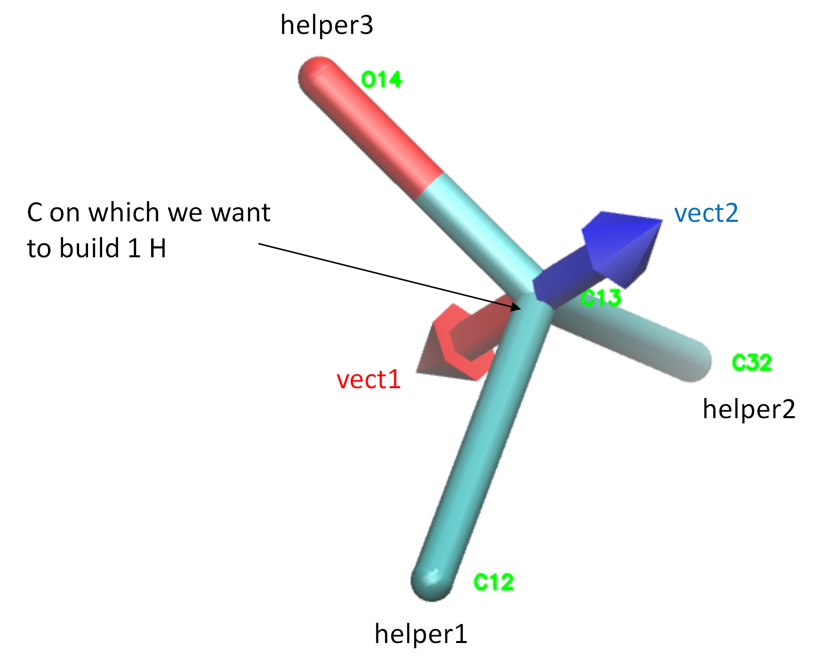

# Algorithm for building hydrogens

**buildH** builds hydrogens using general geometric rules which are explained in this document. All the Python functions implementing these reconstructions are written in `hydrogens.py`. These functions are largely inspired from [a code of Jon Kapla](https://github.com/kaplajon/trajman/blob/master/module_trajop.f90#L242) originally written in fortran. All mathematical functions (vector operations, rotations, etc.) are written in `geometry.py` and accelarated using [Numba](https://numba.pydata.org/). In this page, we use the following conventions:

- all represented vectors are unit vectors;
- $\theta$ is the [tetrahedral bond angle](https://en.wikipedia.org/wiki/Tetrahedron) which equals ~109.5°;
- $l_{CH}$ is the [carbon-hydrogen bond length](https://en.wikipedia.org/wiki/Carbon%E2%80%93hydrogen_bond) which equals ~ 1.09 Å.

## Building CH2

The building of 2 hydrogens from a carbon trace involves a few geometrical procedures that are explained in the figure below.

We start with the 3 atoms, the central carbon on which we want to reconstruct hydrogens (`C26`), helper1 (`C25`) and helper2 (`C27`) which are connected to the central carbon. The two helpers will help us build the new hydrogens following standard [tetrahedral geometry](https://en.wikipedia.org/wiki/Tetrahedral_molecular_geometry). 

On the left panel, we first show how to construct 3 vectors:

- `vect1` (red) is normal to the plane of the 3 atoms. It is calculated as the cross product between vector "central carbon -> helper2" and vector "central carbon -> helper1".
- `vect2` (blue) will be our **rotation axis** used later. It is calculated as vector "central carbon -> helper1" minus vector "central carbon -> helper2".
- `vect3` (green) is a vector that will be rotated in the next step. It is the cross product between `vect1` and `vect2`.

On the right panel, we go on to construct 2 other vectors:

- `vect4` (magenta) is obtained by rotating `vect3` of $\frac{\theta}{2}$ about `vect2`. The first H will be obtained by translating a point located at the central carbon along `vect4` of $l_{CH}$ Å.
- `vect5` (orange) is obtained by rotating `vect3` of $-\frac{\theta}{2}$ about `vect2`. The second H will be obtained by translating a point located at the central carbon along vect5 of $l_{CH}$ Å.

## Building CH

The building of 1 hydrogen from a tertiary carbon is quite simple and explained in the figure below.

We first compute the red vector `vect1` as the sum of the 3 vectors "central carbon -> helper1" + "central carbon -> helper2" + "central carbon -> helper3". We see that this `vect1` defines a [median](https://en.wikipedia.org/wiki/Median_(geometry)#Tetrahedron) of the tetrahedron. The blue vector `vect2` is merely the opposite of `vect1` and gives the direction of the C-H bond. The new H will be obtained by translating a point located at the central carbon along `vect2` of $l_{CH}$ Å.

## Building CH3

Building a methyl on a "carbon" requires two helpers: i) helper1 is connected to the carbon, ii) helper2 is connected to helper1. We start with the reconstructruction of the first hydrogen as explained in the figure below.

`vect1` (red) is first computed as the vector product between vector "carbon -> helper2" and vector "carbon -> helper1". `vect2` (blue) is then computed by rotating vector "carbon -> helper1" about `vect1` by $\theta$. The first H will be obtained by translating a point located at the "carbon" along `vect2` of $l_{CH}$ Å.

We then go on with the reconstruction of the two other Hs as explained in the figure below.

`vect3` (green) is obtained by rotating `vect2` of $+\frac{2\pi}{3}$ about vector "carbon -> helper1". 
`vect4` (magenta) is obtained by rotating `vect2` of $-\frac{2\pi}{3}$ about vector "carbon -> helper1". 

The second and third H will be obtained by translating of $l_{CH}$ Å a point located at the "carbon" along `vect3` and `vect4` respectively.
