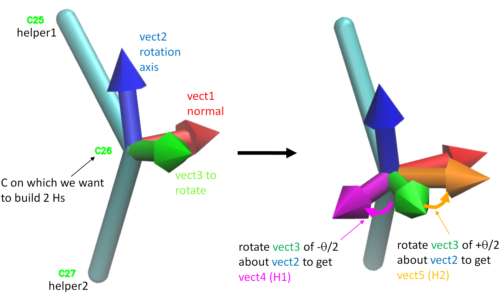

# Algorithm for building hydrogens

**buildH** builds hydrogens using general geometric rules which are explained in this document. All the Python functions implementing these reconstructions are written in `hydrogens.py`. These functions are largely inspired from [a code of Jon Kapla](https://github.com/kaplajon/trajman/blob/master/module_trajop.f90#L242) originally written in fortran. All mathematical functions (vector operations, rotations, etc.) are written in `geometry.py` and accelarated using [Numba](https://numba.pydata.org/).

## Building CH2

The building of 2 hydrogens from a carbon trace involves a few geometrical procedures that are explained in the figure below.

We start with the 3 atoms, the central atom on which we want to reconstruct hydrogens (`C26`), helper1 (`C25`) and helper2 (`C27`) which are connected to the central carbon. Let us call this latter "atom". The two helpers will help us build the new hydrogens following standard [tetraedral geometry](https://en.wikipedia.org/wiki/Tetrahedral_molecular_geometry). 

In the figure, all vectors shown are unit vectors. On the left panel, we first show how to reconstruct 3 vectors:

- vect1 (red) is normal to the plane of the 3 atoms. It is calculated as the cross product between vector "atom -> helper2" and vector "atom -> helper1".
- vect2 (blue) will be our **rotation axis** used later. It is calculated as vector "atom -> helper1" minus vector "atom -> helper2".
- vect3 (green) is a vector that we will rotate in the next step. It is the cross product between vect1 and vect2.

On the right panel, we go on to reconstruct 2 other vectors:

- vect4 (magenta) is obtained by rotating vect3 of theta/2 about vect2. The first H will be obtained by translating "atom" along vect4 of $l_{CH}$ Å.
- vect5 (orange) is obtained by rotating vect3 of -theta/2 about vect2. The second H will be obtained by translating "atom" along vect5 of $l_{CH}$ Å.

In these last two operations, theta is the [tetrahedral bond angle](https://en.wikipedia.org/wiki/Tetrahedron) which equals ~109.5°, and $l_{CH}$ is the [carbon-hydrogen bond length](https://en.wikipedia.org/wiki/Carbon%E2%80%93hydrogen_bond) which equals ~ 1.09 Å.
