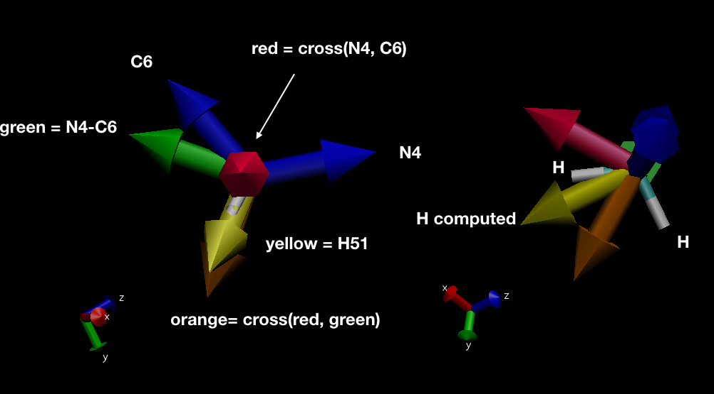

## Motivation

The initial motivation comes from the [NMRlipids](https://nmrlipids.blogspot.com/) project. As stated in this [post](https://nmrlipids.blogspot.com/2019/04/nmrlipids-ivb-assembling-pe-pg-results.html), there was a lack of suitable program for reconstructing hydrogens. In the past, we used to use `g_protonate` in GROMACS 3.*. But this program has been removed in recent versions. Our idea was to build our own implementation in Python upon libraries such MDAnalysis, Numpy and Pandas..


## Features

BuildH can :
  - reconstruct hydrogens from a **united-atom** structure file (PDB, GRO) or a trajectory.
  - calculate the order parameter based on the reconstructed hydrogens
  - write a new structure/trajectory file with the reconstructed hydrogens


BuildH works in two modes :
  1.  A slow mode when an output trajectory (e.g. in xtc format) is requested by
     the user. In this case, the whole trajectory including newly built
     hydrogens are written to this trajectory.
  2. A fast mode without any output trajectory.


## Usage

```
$ buildH
usage: buildH [-h] -c COORD [-t TRAJ] -l LIPID [-lt LIPID_TOPOLOGY [LIPID_TOPOLOGY ...]]
               -d DEFOP [-opx OPDBXTC] [-o OUT] [-b BEGIN] [-e END] [-pi PICKLE]

This program builds hydrogens and calculate the order parameters (OP) from a
united-atom trajectory. If -opx is requested, pdb and xtc output files with
hydrogens are created but OP calculation will be slow. If no trajectory output
is requested (no use of flag -opx), it uses a fast procedure to build
hydrogens and calculate the OP.

optional arguments:
  -h, --help            show this help message and exit
  -c COORD, --coord COORD
                        Coordinate file (pdb or gro).
  -t TRAJ, --traj TRAJ  Input trajectory file. Could be in XTC, TRR or DCD format.
  -l LIPID, --lipid LIPID
                        Residue name of lipid to calculate the OP on (e.g.
                        POPC).
  -lt LIPID_TOPOLOGY [LIPID_TOPOLOGY ...], --lipid_topology LIPID_TOPOLOGY [LIPID_TOPOLOGY ...]
                        User topology lipid json file(s). Mandatory to build hydrogens.
  -d DEFOP, --defop DEFOP
                        Order parameter definition file. Can be found on
                        NMRlipids MATCH repository:https://github.com/NMRLipid
                        s/MATCH/tree/master/scripts/orderParm_defs
  -opx OPDBXTC, --opdbxtc OPDBXTC
                        Base name for trajectory output with hydrogens. File
                        extension will be automatically added. For example
                        -opx trajH will generate trajH.pdb and trajH.xtc. So
                        far only xtc is supported.
  -o OUT, --out OUT     Output base name for storing order parameters.
                        Extention ".out" will be automatically added. Default
                        name is OP_buildH.out.
  -b BEGIN, --begin BEGIN
                        The first frame (ps) to read from the trajectory.
  -e END, --end END     The last frame (ps) to read from the trajectory.
  -pi PICKLE, --pickle PICKLE
                        Output pickle filename. The structure pickled is a dictonnary containing for each Order parameter,
                        the value of each lipid and each frame as a matric

The list of supported lipids (-l option) are: CHARMM_POPC, Berger_POPC, Berger_PLA, Berger_POP.
```


The program needs one mandatory file (present in this repo):
- `order_parameter_definitions_MODEL_Berger_POPC.def` (option `-d`).


#### dic_lipids.py

This file is used as a module and contains a list of dictionaries based on the type of lipids (POPC,DOPC,...) and the force field (Berger, GROMOS, etc). The chosen lipid/FF is passed to `buildH` with `-l` option (e.g. `-l Berger_POPC`).
The dictionary is a list of carbon atoms from which the hydrogens are built.
For each carbon atom, there is the type of bonds (CH3, CH2, etc) and the 2 (or 3) others atoms needed for the reconstruction (see Algorithm).
So far, the file contains Berger POPC and CHARMM36 POPC (this latter is used for validation only, since it is an all-atom force field). It will be updated in the future with some other united-atom force fields and other lipid types models.

#### order_parameters_definitions_MODEL_X_Y.def

This file is a mapping file created for the [NMRlipids](https://nmrlipids.blogspot.com/) project.
It aims at giving a unique name for each order parameter value along the lipid regardless the model of lipid used. This `.def` files can be found on the [MATCH repository](https://github.com/NMRLipids/MATCH/tree/master/scripts/orderParm_defs). Two examples of such files are present in directories `docs/Berger_POPC_test_case` and `docs/CHARMM36_POPC_validation`.

If an output trajecotry (option `-opx`) is requested, this `.def` file **must** contain all possible pairs of C-H to reconstruct (since the whole trajectory with Hs will be reconstructed). This option is slow, we do not recommend it if an output xtc file is not wanted.

If no option `-opx` is used buildH uses fast indexing. In this case the `.def` file can contain any subset of all possible C-H pairs. For example, if one wants to get OPs for the polar head only (Berger POPC), the `.def` file could look like the following:

```
beta1 POPC C5  H51
beta2 POPC C5  H52
alpha1 POPC C6  H61
alpha2 POPC C6  H62
g3_1 POPC C12 H121
g3_2 POPC C12 H122
g2_1 POPC C13 H131
g1_1 POPC C32 H321
g1_2 POPC C32 H322
```

## Examples

A couple of test cases on Berger POPC are avaialble in the `docs/Berger_POPC_test_case` folder from the [GitHub repository of the project](https://github.com/patrickfuchs/buildH).

Here are some examples on how to run `buildH`:

- Basic run on a single structure (default name for output OPs will be used):
  ```bash
  buildH start_128popc.pdb -l Berger_POPC \
  -d order_parameter_definitions_MODEL_Berger_POPC.def
  ```
- Same but an output file for OPs name is given:
  ```bash
  buildH start_128popc.pdb -l Berger_POPC \
  -d order_parameter_definitions_MODEL_Berger_POPC.def \
  -o OP_buildH.out
  ```
- Run `buildH` on a trajectory `traj.xtc`:
  ```bash
  buildH start_128popc.pdb -l Berger_POPC \
  -d order_parameter_definitions_MODEL_Berger_POPC.def \
  -x traj.xtc
  ```
- Run `buildH` on a trajectory `traj.xtc` with the trajecory outputs with hydrogens (`traj_with_H.xtc` and `traj_with_H.pdb`), and a default file name for the OP:
  ```bash
  buildH start_128popc.pdb -l Berger_POPC \
  -d order_parameter_definitions_MODEL_Berger_POPC.def \
  -x traj.xtc -opx traj_with_H
  ```
  Note that in this last case, the `.def` file **must** contain all possible pairs of C-H to reconstruct. (since the whole trajectory with Hs will be reconstructed).

## Validation of buildH

The folder `docs/CHARMM36_POPC_validation` contains a thorough validation of `buildH` using a trajectory created with the CHARMM36 all-atom force field.

## Algorithm for building hydrogens

The way of building H is largely inspired from a code of Jon Kapla originally written in fortran:
<https://github.com/kaplajon/trajman/blob/master/module_trajop.f90#L242>.

Below is an example of a reconstruction of 2 hydrogens (*H51* and *H52*) attached to a carbon *C5* with the help of 2 others atom *C6* and *N4*.



First, we compute the cross product between the vector C5-C6 and C5-N4 (red).

We determine a rotational axis determined by the vector N4-C6. (green)

We compute the cross product between the red one and green one. (orange)

This orange vector is the rotational vector to construct the hydrogens.

For this case, 2 hydrogens are constructed (yellow) : we apply a rotation of 109.47 deg for one and -109.47 deg for the other one.

## TODO

How the other hydrogens are reconstructed (CH3, CH double bond, CH).
