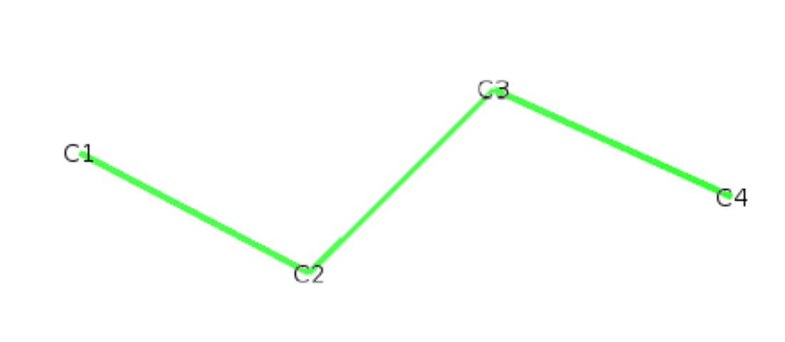
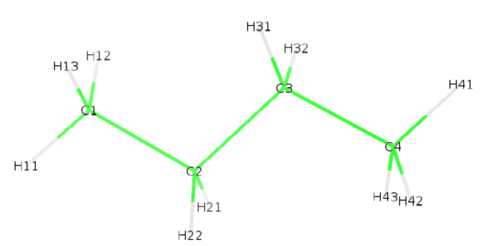

# Lipid def file format

## Role of def files

The def file has two main functions:

- Tell **buildH** which C-H are considered (for H reconstruction and order parameter calculation).
- Give a generic name to each C-H for the output of the order parameter (the default name for that file is `OP_buildH.out`).

Initially, this type of file has been created in the [NMRlipids](https://nmrlipids.blogspot.com/) project. Starting from all-atom trajectories, the script [calcOrderParameters.py](https://github.com/NMRLipids/MATCH/blob/master/scripts/calcOrderParameters.py) takes such def files as input to infer what C-H are considered for the calculation. But it is also useful for assigning a unique generic name for each C-H along the lipid regardless of the force field considered. For example, the two C-H of of the beta carbon of the choline are called `beta1` and `beta2` in all PC lipids whatever the force field.

Many of these `.def` files can be found on the [MATCH repository](https://github.com/NMRLipids/MATCH/tree/master/scripts/orderParm_defs) for all-atom force fields. As in **buildH** we work with united-atom trajectories, there is a directory [def_files](https://github.com/patrickfuchs/buildH/tree/master/def_files) where you will find all the def files for the lipids supported.

## Format of def files

The general naming convention of def files on NMRLipids is `order_parameters_definitions_MODEL_X_Y.def`, where `X` is the force field and `Y` the lipid considered. You can name it whatever you like, but we recommend to indicate at least the force field and the lipid.

Each line represents a given C-H with 4 columns:

- Column 1 is the generic name of the order parameter considered. We recommend to use the same convention as those already present in the [def_files](https://github.com/patrickfuchs/buildH/tree/master/def_files) provided in **buildH**.
- Column 2 is the residue name in the pdb or gro file.
- Column 3 is the carbon name in the pdb or gro file for that C-H.
- Column 4 is the H name in the pdb or gro file for that C-H.

Here is an example for the polar head of [Berger POPC](https://github.com/patrickfuchs/buildH/blob/master/def_files/Berger_POPC.def):

```
beta1 POPC C5  H51
beta2 POPC C5  H52
alpha1 POPC C6  H61
alpha2 POPC C6  H62
g3_1 POPC C12 H121
g3_2 POPC C12 H122
g2_1 POPC C13 H131
g1_1 POPC C32 H321
g1_2 POPC C32 H322
```

Each column has to be separated by any combination of white space(s) (at least one).

**Important**

In **buildH** the hydrogens basically do not exist before running the program, and the program uses the following convention: each reconstructed H will have the same base name as the carbon (with `C` replaced by `H`) followed by a number (`1`, `2` or `3`). For example, if the carbon is called `C5` and has two Hs, they will be called `H51` and `H52`. If the carbon is called `CA2` and has three Hs, they will be called `HA21`, `HA22` and `HA23`. If the carbon is called `C13` and has one H, it will be called `H131`

**We highly recommend to use this convention!**

## Trajectory output and def files

If an output trajectory (option `-opx`) is requested, the `.def` file provided **must** contain all possible C-H in that lipid (since the whole trajectory with Hs will be reconstructed). This option is slow, we do not recommend it if an output xtc file is not wanted.

If no option `-opx` is used, **buildH** uses fast indexing. In this case the `.def` file can contain any subset of all possible C-H pairs. For example, if one wants to get the order parameters of the polar head only (Berger POPC), the `.def` will be the following:

```
beta1 POPC C5  H51
beta2 POPC C5  H52
alpha1 POPC C6  H61
alpha2 POPC C6  H62
g3_1 POPC C12 H121
g3_2 POPC C12 H122
g2_1 POPC C13 H131
g1_1 POPC C32 H321
g1_2 POPC C32 H322
```

Of course, a lower number of Hs to reconstruct will make **buildH** run faster.

## A guided example for writing a lipid def file

We show here how to build your own def file on the simple molecule of butane. We start with a pdb file of the molecule `butane.pdb`:

```
ATOM      1  C1  BUTA    1      -1.890   0.170   0.100  1.00  0.00
ATOM      2  C2  BUTA    1      -0.560  -0.550  -0.100  1.00  0.00
ATOM      3  C3  BUTA    1       0.540   0.520  -0.110  1.00  0.00
ATOM      4  C4  BUTA    1       1.910  -0.140   0.100  1.00  0.00
```



Let us consider first `C1` which has 3 hydrogens to reconstruct. The new hydrogens will be called `H11`, `H12` and `H13`. The residue name is `BUTA`. Since the butane molecule does not exist in known def files, we can create any generic name we want for each C-H. Following the same model as [Berger_POPC.def](https://github.com/patrickfuchs/buildH/blob/master/def_files/Berger_POPC.def), we could name them `butane_C1a`, `butane_C1a` and  `butane_C1c`. Applying this to all possible C-H, we obtain:

```
butane_C1a BUTA C1 H11
butane_C1b BUTA C1 H12
butane_C1c BUTA C1 H13
butane_C2a BUTA C2 H21
butane_C2b BUTA C2 H22
butane_C3a BUTA C3 H31
butane_C3b BUTA C3 H32
butane_C4a BUTA C4 H41
butane_C4b BUTA C4 H42
butane_C4c BUTA C4 H43
```

Following the file naming convention `Forcefield_Lipid.def`, this file should be called `Berger_BUTA.def`.

We also have to create the json file (see [here](json_format.md#a-guided-example-for-writing-a-lipid-json-file) on how to do that). We can use the following `Berger_BUTA.json`:

```
{
    "resname": ["BUTA", "BUT"],
    "C1": ["CH3", "C2", "C3"],
    "C2": ["CH2", "C1", "C3"],
    "C3": ["CH2", "C2", "C4"],
    "C4": ["CH3", "C3", "C2"]
}
```

With those 3 files, we can launch buildH:

```bash
buildH -c butane.pdb -l Berger_BUTA -lt Berger_BUTA.json -d Berger_BUTA.def -opx butane_wH
```

We gave our newly created def file to **buildH** with the option `-d`. We also used our own `Berger_BUTA.json` file with the option `-lt`. We requested an ouput with the option `-opx` which will generate the pdb with hydrogens `butane_wH.pdb`. Below is shown the generated pdb and structure.

```
ATOM      1  C1  BUTA    1      -1.890   0.170   0.100  1.00  0.00             C
ATOM      2  H11 BUTA    1      -2.700  -0.560   0.113  1.00  0.00             H
ATOM      3  H12 BUTA    1      -2.048   0.874  -0.717  1.00  0.00             H
ATOM      4  H13 BUTA    1      -1.872   0.710   1.047  1.00  0.00             H
ATOM      5  C2  BUTA    1      -0.560  -0.550  -0.100  1.00  0.00             C
ATOM      6  H21 BUTA    1      -0.566  -1.088  -1.048  1.00  0.00             H
ATOM      7  H22 BUTA    1      -0.390  -1.253   0.716  1.00  0.00             H
ATOM      8  C3  BUTA    1       0.540   0.520  -0.110  1.00  0.00             C
ATOM      9  H31 BUTA    1       0.356   1.235   0.692  1.00  0.00             H
ATOM     10  H32 BUTA    1       0.531   1.039  -1.069  1.00  0.00             H
ATOM     11  C4  BUTA    1       1.910  -0.140   0.100  1.00  0.00             C
ATOM     12  H41 BUTA    1       2.687   0.625   0.092  1.00  0.00             H
ATOM     13  H42 BUTA    1       2.096  -0.855  -0.702  1.00  0.00             H
ATOM     14  H43 BUTA    1       1.920  -0.658   1.059  1.00  0.00             H
```



**Last advices**

- We showed you a simple example on butane. Although this molecule is very simple, you can see that it is easy to make a mistake. Although this def file is less critical than the [json lipid file](json_format.md), we recommend to double check it before using it for production. **buildH** makes for you a lot of checks and will throw an error if something is wrong, but it cannot detect all types of mistakes. Any spelling error on atom names, inversion, etc., may lead to nonsense results. So before going to production, do test on a single molecule and check thoroughly the output looks right.

- The main lipids are already included in **buildH** (in the directory [`buildh/lipids`](https://github.com/patrickfuchs/buildH/tree/master/def_files)) so you might not need to build your own def file. You can have a list of the supported lipids by invoking **buildH** with option `-h`:

```
$ buildH -h
usage: buildH [-h] -c COORD [-t TRAJ] -l LIPID [-lt LIPID_TOPOLOGY [LIPID_TOPOLOGY ...]] -d DEFOP
[...]
The list of supported lipids (-l option) are: Berger_POP, Berger_PLA, Berger_POPC, CHARMM36_POPC.
```

- Last, one other project developed by us, called [autoLipMap](https://github.com/patrickfuchs/autoLipMap), can build automatically def and json files for the main known lipids.

In case of problem, you can post an issue on github.
