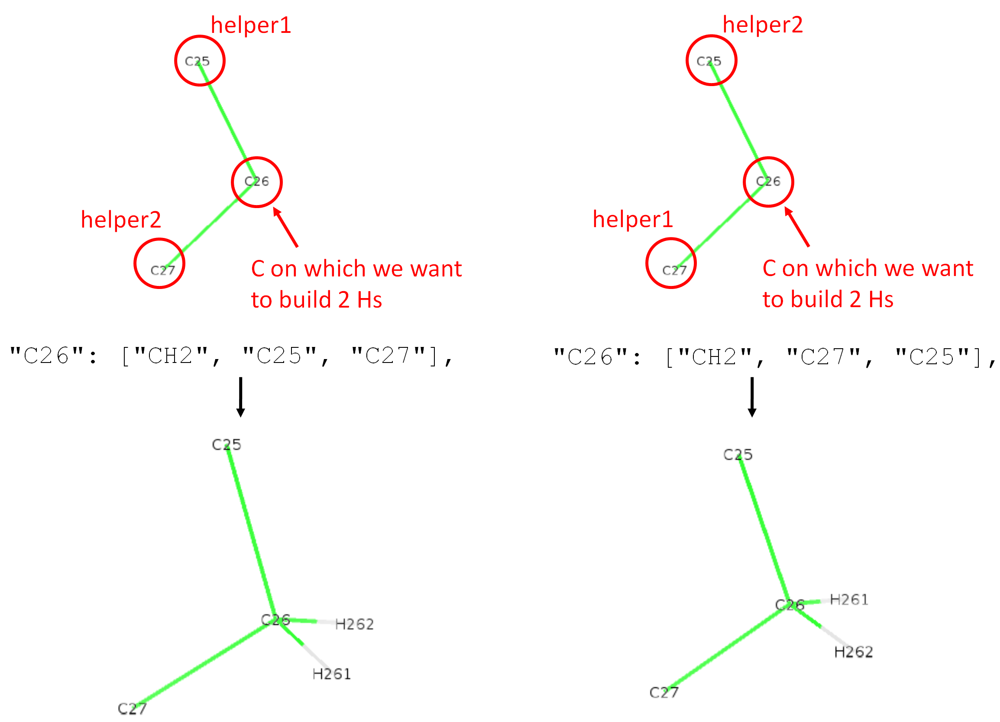

# Lipid json file format

To build new hydrogens on a united-atom lipid, we need different informations that are read by **buildH** in a json file. By default, some standard lipids are present in buildH (in the directory `buildh/lipids/`). However, it is possible for the user to supply his/her own json file. Here we explain the format of these json files.

## Generality of the json format

The format ressembles a Python dictionnary. For example, if we look at the `Berger_POPC.json` file, we have the following:

```
{
  "resname": ["POPC", "PLA", "POP"],
  "C1": ["CH3", "N4", "C5"],
  "C2": ["CH3", "N4", "C5"],
  "C3": ["CH3", "N4", "C5"],
  "C5": ["CH2", "N4", "C6"],
  "C6": ["CH2", "C5", "O7"],
  "C12": ["CH2", "O11", "C13"],
  "C13": ["CH", "C12", "C32", "O14"],
[...]
  "C24": ["CHdoublebond", "C23", "C25"],
  "C25": ["CHdoublebond", "C24", "C26"],
  "C26": ["CH2", "C25", "C27"],
[...]
  "C48": ["CH2", "C47", "C49"],
  "C49": ["CH2", "C48", "C50"],
  "C50": ["CH3", "C49", "C48"]
  }
```

Each lines has a `key: value` pattern (as in a Python dictionnary). The value ressembles a Python list `[value1, value2, ...]`. Each couple `key: value` is separated by a comma. At the beginning and end of the file we have curly braces `{}`. 

**Important**: notice that the last line (atom `"C50"`), *the comma is not present* at the end of the line.

The first line with a key `"resname"` indicates some possible residue names for the lipid described in the file. Here for example, it can be called `"POPC"`, `"PLA"` or `"POP"` in the pdb or gro file. Don't forget the quotes for each elements.

In the the next lines, each key is basically an atom name between quotes (same name as found in the pdb or gro file), followed by a list containing 3 or 4 strings:

- The first string can be either `"CH"`, `"CH2"`, `"CH3"` or `"CHdoublebond"`. It indicates to buildH if we want to reconstruct one H, two Hs, 3 Hs (sp3 carbon) or one H of a double bond (sp2 carbon) respectively. In fact, it represents the type of carbon on which we want to build hydrogens.
- The next strings are called helpers (see below) and are atom names between quotes. We have 2 helpers for `"CH2"`, `"CH3"` or `"CHdoublebond"`, and 3 helpers for `"CH"`.

So the general syntax is `[type of C on which we want to build Hs, name of helper1, name of helper2, ...]`. The choice of helpers and their order in the json file depends on the type of carbon. Everything is described below.

## Building CH3 

In the figure below is shown a resconstruction of 3 hydrogens (methyl group) on atom `C1`. In the json file, it corresponds to the line `"C1": ["CH3", "N4", "C5"],`. The first helper (helper1) needs to be the one connected to `C1` (thus `N4`), and the second helper (helper2) is connected to `N4` and 2 atoms away from `C1` (thus `C5`) along the main chain. The 3 reconstructed H will have names `H11`, `H12`, `H13`. The first character `1` is the same as the carbon number, the second character is the hydrogen number (`1`, `2` or `3`). 


In this example, the use of `C2` or `C3` as helper2 would have worked too. However, we decided to use `C5` because it stands along the main chain of the lipid.

## Building CH2

In the figure below is shown the resconstruction of 2 hydrogens (methylene group) on atom `C26`. On the left is shown a CH2 reconstruction coming from the line `"C26": ["CH2", "C25", "C27"],` in the json file. `"CH2"` means we want to reconstruct 2 hydrogens, `"C25"` is helper1, `"C27"` is helper2. With `C25` being up and `C27` being down, the new hydrogens reconstructed are arranged in space so that `H261` comes towards us and `H262` goes backwards. Their name `H261` or `H262` follows the same rule as for CH3: `26` means the Hs are connected to `C26` and the last digit is the hydrogen number (`1` or `2`). 

On the right, we show the other case where we swapped the order of helper1 and helper2. One can see that the two reconstructed hydrogens are also swapped. **This shows that the order of helpers matters!** for CH2 reconstruction.



**TODO**: tells which H is pro-R and pro-S.

## Building CH

BLABLABLA


